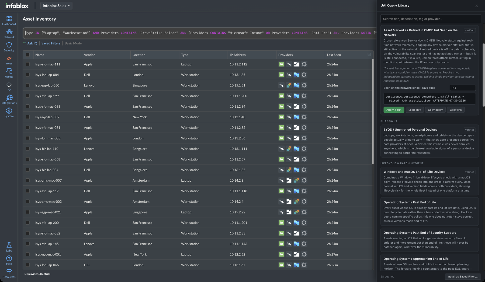
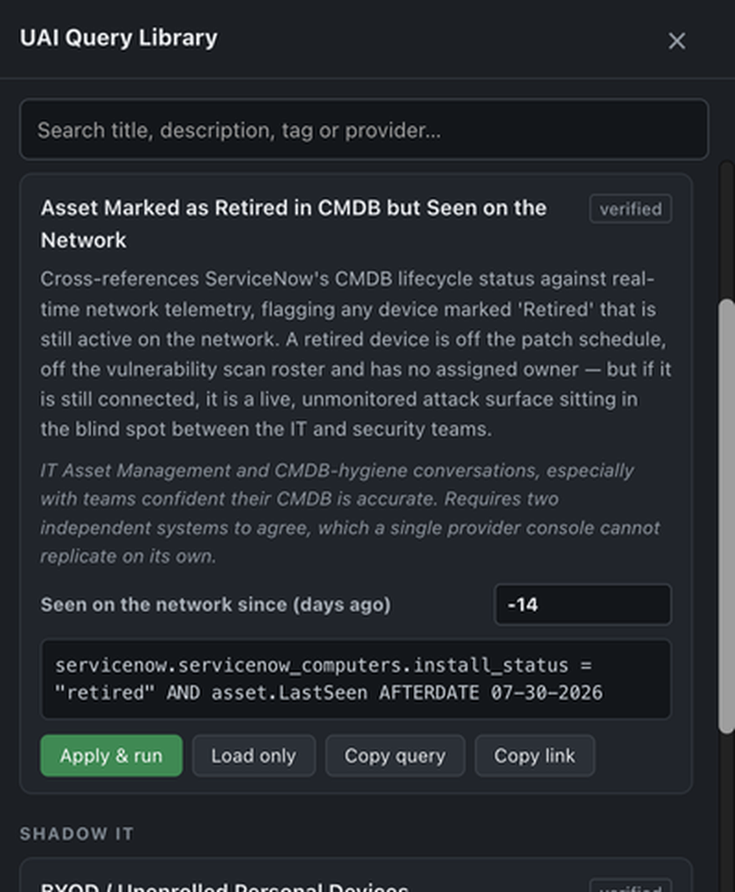

# UAI Query Library

**A library of ready-made questions you can ask your asset data — one click, no query syntax to learn.**

Universal Asset Insights reconciles CMDB, EDR, MDM, cloud, network and DNS data into one record per asset, and lets you query that record directly. The hard part was never running a query. It is knowing *which* query to run, and remembering the exact syntax when you are sitting in front of someone.

This adds a **Query Library** button to the Asset Inventory page. Click it, pick a question, and the query drops into the filter bar and runs.

Questions like:

- Which assets have no forward DNS record?
- What is on the network that we could not even identify?
- Which addresses is IPAM not tracking?
- What is running an OS that is already past end of life?
- What is connected but has not been seen for a week?

28 of them, each with a plain-English explanation of what it finds and why it matters.

*The library open next to Asset Inventory. The query in the filter bar came from the panel on the right — one click.*

> **An Infoblox project.** Built by the Infoblox SE team as a convenience wrapper around Universal Asset Insights' own filter box. It is not part of the shipping product and carries no support SLA — but the queries in it are real, and most have been run against live tenants with the results checked by hand.

---

## Getting started

Never used a "userscript" before? That is fine — this takes about three minutes and you do not need to know anything about GitHub.

A userscript is a small piece of code that runs on one specific website and adds something to it. You need one free browser extension to run it. That is the whole idea.

### Step 1 — Install the extension that runs userscripts

Pick the one for your browser and click **Add to browser**:

- **Chrome or Edge** → [Tampermonkey](https://chromewebstore.google.com/detail/tampermonkey/dhdgffkkebhmkfjojejmpbldmpobfkfo)
- **Firefox** → [Violentmonkey](https://addons.mozilla.org/firefox/addon/violentmonkey/) or [Tampermonkey](https://addons.mozilla.org/firefox/addon/tampermonkey/)
- **Safari** → [Userscripts](https://apps.apple.com/app/userscripts/id1463298887)

You will see a small icon appear in your browser toolbar. That is it — you never really need to touch it again.

> **On a managed work laptop?** Extension installs may be blocked by policy. If the install button does nothing, ask IT to allow Tampermonkey, or see [No extension allowed?](#no-extension-allowed) below.

### Step 2 — Chrome and Edge only: switch on "Allow user scripts"

**Skip this on Firefox and Safari.** On Chrome and Edge it is not optional, and it is the single most common reason people think the library is broken: without it, userscripts simply never run. No error, no warning on the page — the Query Library button just never appears.

1. Go to **`chrome://extensions`** (on Edge, **`edge://extensions`**). Type it into the address bar; it is not in the menu.
2. Find **Tampermonkey** and click **Details**.
3. Scroll down and turn on **Allow user scripts**.

That is a per-extension permission, so you only do it for Tampermonkey, and only once.

> **Older versions of Chrome** don't have that toggle. Instead, turn on **Developer mode** with the switch in the top-right corner of `chrome://extensions`. If you see the "Allow user scripts" toggle, use that and leave Developer mode alone.

### Step 3 — Install the Query Library

**[⬇️ Click here to install](https://github.com/IngmarVG-IB/infoblox-uai-query-library/raw/main/dist/uai-query-library.user.js)**

Your userscript extension will recognise the file and open an installation page showing you the code. Click **Install**.

That page is worth a look: it is the entire script, and you can read exactly what it does before installing it. It makes no network calls of its own and sends no data anywhere.

### Step 4 — Open Asset Inventory

Go to your Infoblox portal, then **Assets → Inventory**.

A green **Query Library** button appears in the bottom-right corner. Click it.

> **No button?** Two things to check, in this order.
>
> 1. **On Chrome or Edge, go back and do Step 2.** A skipped "Allow user scripts" toggle looks exactly like this — nothing happens at all.
> 2. **Make sure you are on the inventory, not the dashboard.** `Network → Assets` opens an Assets *dashboard* — charts and tiles, no filter bar. The button deliberately stays away from that page, because there is nothing there for it to type into. Use **Assets → Inventory**, or click through a dashboard tile to reach the asset table.

### Step 5 — Run your first query

The panel opens on the right with the queries grouped by theme.

1. Click any query's **title** to expand it. You will see the exact filter it will run.
2. Click **Apply & run**.
3. Results appear in the table behind the panel.

That is the whole workflow.

---

## What you will see in the panel

Click a query's title and it opens up like this — everything about it in one place.

**A `verified` tag** — this query has been run against a live tenant and the result was hand-checked. Queries without it are syntactically valid but have not been confirmed to return meaningful results everywhere.

**A greyed-out query with an amber `needs …` tag** — this query depends on a data source your tenant does not have connected. A query about ServiceNow records cannot tell you anything if ServiceNow is not integrated, so rather than silently returning nothing, it says so.

**Editable boxes on some queries** — things like *"Not seen since (days ago)"*. Change the number and the query updates live. This is why the library does not go stale: nothing has a hard-coded date buried in it.

**Four buttons on each query:**

| Button | What it does |
|---|---|
| **Apply & run** | Puts the query in the filter bar and runs it. The normal one. |
| **Load only** | Puts it in the filter bar without running, so you can edit it first. |
| **Copy query** | Copies the query text to your clipboard. |
| **Copy link** | Copies a URL that opens Asset Inventory with this query pre-loaded — handy for sharing with a colleague. They still press Apply themselves. |

---

## One thing worth knowing

Asset Inventory starts with a `Managed IS "True"` filter already applied. **Clear it before running a library query.** Every query here is already scoped on purpose, so leaving the default in place just narrows your results without telling you.

---

## Saving queries into your tenant

There is an **Install as Saved Filters…** button at the bottom of the panel. It creates the library as real Saved Filters inside Infoblox, so they show up for everyone using that tenant.

Read this before you use it:

- It **writes to whichever tenant you are signed in to**. That is a shared, visible change — not a local one.
- Everything it creates is named with a `[Library]` prefix so it is obvious what came from here and easy to remove.
- Queries with editable boxes are skipped, because saving one would freeze today's date into it and quietly go stale.
- **Do not run it against a customer's production tenant** without asking them first.

To remove them afterwards: **Saved Filters → See All**, then use the row menu (⋮) → **Delete** on each `[Library]` entry. Delete happens immediately, with no confirmation prompt.

This flow has been run end to end against a live tenant — all 22 eligible queries created successfully.

Everything else in this tool is read-only. This one button is the exception, which is why it asks for confirmation.

---

## No extension allowed?

If you cannot install a browser extension, you can still use the queries — they are all readable as plain text in **[`queries/catalog.json`](queries/catalog.json)**, with the full explanation of each. Copy the query text and paste it into the Advanced Mode filter box by hand.

---

## The queries

| Query | Theme |
|---|---|
| Assets Missing from ServiceNow | CMDB Reconciliation |
| Assets in EDR/MDM Fleet but Not in ServiceNow | CMDB Reconciliation |
| Asset Marked as Retired in CMDB but Seen on the Network | CMDB Reconciliation |
| BYOD / Unenrolled Personal Devices | Shadow IT |
| Windows and macOS End-of-Life Devices | Lifecycle & Patch Hygiene |
| Corporate Managed Laptops with Disk Encryption Off | Compliance |
| CrowdStrike Firewall Not Running and Prevention Policy Not Applied | Security Control Gaps |
| Assets with No Forward DNS Record | DDI Hygiene |
| Assets with No Reverse DNS Record | DDI Hygiene |
| Assets with No IPAM Record | DDI Hygiene |
| Assets Missing Any Core DNS or IPAM Record | DDI Hygiene |
| Zombie Assets | Insight Classifications |
| Assets Flagged as Unencrypted | Insight Classifications |
| Orphaned Assets | Insight Classifications |
| Publicly Accessible Assets | Insight Classifications |
| Idle and Underused Cloud Resources | Insight Classifications |
| Assets Classified as Noncompliant | Insight Classifications |
| Assets Not Seen Recently | Discovery Hygiene |
| Unclassified Assets | Discovery Hygiene |
| Assets Identified with Low Confidence | Discovery Hygiene |
| Assets with No Serial Number | Discovery Hygiene |
| Assets Reporting an Error State | Discovery Hygiene |
| Operating Systems Past End of Life | Lifecycle & Patch Hygiene |
| Operating Systems Past End of Security Support | Lifecycle & Patch Hygiene |
| Operating Systems Approaching End of Life | Lifecycle & Patch Hygiene |
| IoT and OT Devices on the Network | Estate Composition |
| Network Infrastructure Inventory | Estate Composition |
| Cloud-Hosted Assets | Estate Composition |

---

## Privacy and safety

- The script runs **only** on your Infoblox portal page. It cannot see any other tab.
- It makes **no network requests of its own** — no telemetry, no phoning home, no fetching anything at runtime. The queries are baked into the file you installed.
- It **reads no asset data**. It types into the filter box and clicks buttons, exactly as you would.
- Apart from the clearly-marked *Install as Saved Filters* button, it changes nothing in your tenant.
- **Auto-update:** your userscript extension periodically checks GitHub for a new version, so you get new queries without reinstalling. That is the extension talking to github.com, not this script, and you can switch it off in the extension's settings.

---

## Will these work in my tenant?

The queries themselves are portable — tested across two different tenants, the syntax and values behave identically even though the autocomplete presents them differently.

What varies is **what your tenant actually has connected**. A query about ServiceNow records cannot tell you anything if ServiceNow is not integrated. That is what the greyed-out `needs …` tags are for: the panel checks your tenant and tells you up front rather than returning an empty table.

18 of the 28 queries have been run against live tenants with the counts hand-checked. The other 10 are valid and run cleanly, but the tenants tested did not hold the data to prove the result is meaningful — they are tagged accordingly, so you always know which is which.

---

## Want to add a query?

Contributions are welcome, and you do not need to be a developer. See **[CONTRIBUTING.md](CONTRIBUTING.md)** — the short version is that a query is worth adding once you have run it against a real tenant and can point at the field that produced the match.

## Also here

- **[Query language reference](docs/query-language.md)** — the fields, operators and values available in Advanced Mode, written down in one place because they are not documented anywhere else.

## Licence

[MIT](LICENSE) — free to use, modify and share.
